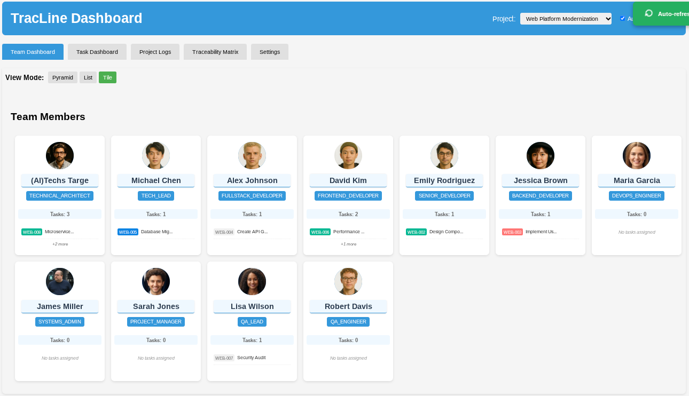
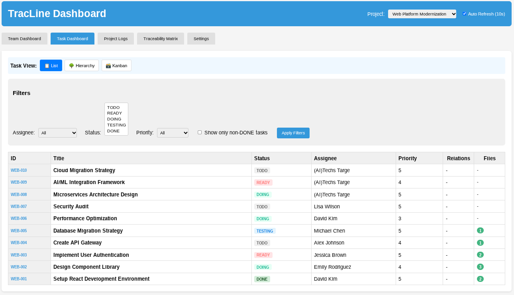
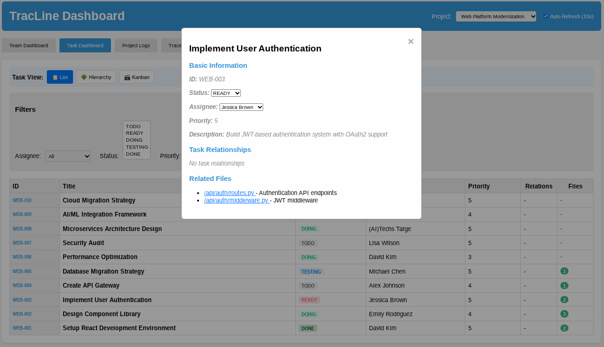
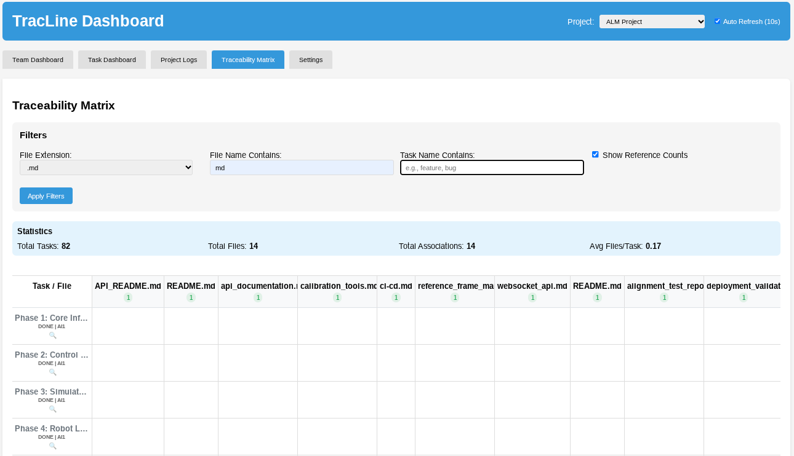

# TracLine

A comprehensive task management and traceability system with hierarchical team organization.

**Current Version**: 2.0.2 | **Python**: 3.8+ | **Status**: Active Development

## Features

- **Team Management**: Hierarchical organization with pyramid and org chart views
- **Task Management**: Complete task lifecycle with status tracking
- **Web Interface**: Modern web UI with multiple view modes
- **Database Support**: PostgreSQL (primary) and SQLite support
- **File Traceability**: Track which tasks reference specific files with `ls-trace` command
- **File System Monitoring**: Real-time monitoring of project files with automatic association tracking
- **GitHub Integration** *(Experimental)*: Bidirectional synchronization with GitHub Issues - Currently under active development
- **Traceability Matrix**: Visual file-task relationship tracking
- **Photo Management**: Team member photo upload with cropping
- **Reference Counting**: Automatic tracking of file reference counts
- **Project-specific Settings**: Configure monitoring and integrations per project
- **Strict Mode Enforcement**: Ensure quality with document read confirmation, file reference requirements, and log entry enforcement

## Screenshots

### Team Members Dashboard

*View and manage team hierarchy with profile photos and organizational structure*

### Task List View

*Track tasks with status indicators, priorities, and assignments*

### Task Detail View

*Detailed task information with file associations and activity logs*

### Traceability Matrix

*Visual representation of file-task relationships for complete traceability*

## Important Notice

### Experimental Features

The following features are currently experimental and under active development:

- **GitHub Integration**: The GitHub Issues synchronization feature is in research phase. While basic functionality exists, full implementation is planned for future releases. Use with caution in production environments.

We welcome feedback and contributions to help improve these experimental features.

## Quick Install

### Ubuntu/Debian with PostgreSQL (Recommended)
```bash
# Basic installation
curl -fsSL https://raw.githubusercontent.com/techs-targe/TracLine/main/scripts/install-ubuntu.sh | bash

# Installation with sample data (auto-loaded on first run)
curl -fsSL https://raw.githubusercontent.com/techs-targe/TracLine/main/scripts/install-ubuntu.sh | bash -s -- --sample-data
```

> **Note:** This installs TracLine globally using pipx and runs PostgreSQL in Docker on port 5432.

### Ubuntu/Debian with SQLite (No Docker Required)
```bash
# Basic installation
curl -fsSL https://raw.githubusercontent.com/techs-targe/TracLine/main/scripts/install-ubuntu-sqlite.sh | bash

# Installation with sample data (loaded during installation)
curl -fsSL https://raw.githubusercontent.com/techs-targe/TracLine/main/scripts/install-ubuntu-sqlite.sh | bash -s -- --sample-data
```

> **Note:** This installs TracLine with SQLite database. No Docker required, simpler setup.

See [Installation Guide](INSTALL.md) for details or custom configuration.

After installation:
```bash
# IMPORTANT: Update your PATH first
source ~/.bashrc  # or open a new terminal

# Verify installation succeeded  
tracline --version  # Shows TracLine 2.0.1

# Start TracLine
tracline-start              # Normal start (preserves existing data)
tracline-start --sample-data # Start with sample data (first run only)
tracline-start --force-clean # Force clean installation (WARNING: deletes all data)

# Access at http://localhost:8000
```

### Troubleshooting

Having issues? See the **[Troubleshooting Guide](docs/TROUBLESHOOTING.md)** for solutions.

### Other Operating Systems
- **macOS**: See [Installation Guide](INSTALL.md#macos)
- **Windows**: Use [WSL2](https://docs.microsoft.com/windows/wsl/install) with Ubuntu, or see [Installation Guide](INSTALL.md#windows)
- **Other Linux**: See [Installation Guide](INSTALL.md#generic-linux)

### Uninstall
```bash
# Universal uninstaller (works for both PostgreSQL and SQLite installations)
# Basic uninstall (keeps data)
curl -fsSL https://raw.githubusercontent.com/techs-targe/TracLine/main/scripts/uninstall.sh | bash

# Complete uninstall (removes all data)
curl -fsSL https://raw.githubusercontent.com/techs-targe/TracLine/main/scripts/uninstall.sh | bash -s -- --remove-data

# Interactive uninstall (if you have the repo)
cd ~/TracLine && bash scripts/uninstall.sh
```

The uninstaller automatically detects your installation type and removes the appropriate components.

### For Claude Code Development

If you plan to use TracLine with Claude Code for collaborative development, please refer to the comprehensive **[User Guide](docs/USER_GUIDE.md)** which includes:

- Multi-member setup instructions
- Claude Code integration scripts
- Parallel development workflow
- Team coordination guidelines

Quick setup for Claude Code:
```bash
# Install TracLine
pip install -e .

# Setup configuration
mkdir -p ~/.tracline
cp sqlite_config.yaml tracline.yaml

# Copy development guide template
# For local installation:
cp CLAUDE.md.sample CLAUDE.md
# For global installation:
cp CLAUDE.md.sample.globalinstall CLAUDE.md

# Edit CLAUDE.md with your environment-specific settings

# Launch Claude Code for team member
./scripts/claude-code/launch-claude-dev1.sh
```

## Configuration

Edit `tracline.yaml` to configure:
- Database connection settings
- File storage paths
- Application settings

## Web Interface

The web interface provides:
- **Team Dashboard**: View team hierarchy in pyramid, list, or tile modes
- **Task Dashboard**: Manage tasks with kanban-style interface
- **Traceability Matrix**: Track file-task relationships
- **File Viewer**: View and copy file contents with syntax highlighting
- **Settings**: View database configuration
- **Copy Buttons**: Easy copy functionality for code and file contents
- **Photo Upload**: Team member profile photo management with cropping

## Database Support

### PostgreSQL (Recommended)
```yaml
database:
  type: postgresql
  host: localhost
  port: 5432
  name: tracline
  user: postgres
  password: your_password
```

### SQLite
```yaml
database:
  type: sqlite
  path: tracline.db
```

## CLI Commands

### Core Commands
- `tracline init` - Initialize TracLine
- `tracline add` - Add a new task
- `tracline list` - List tasks
- `tracline done` - Mark task as done
- `tracline complete <task_id>` - Mark task as DONE directly (bypasses workflow)
- `tracline show <task_id>` - Show task details
- `tracline update <task_id>` - Update task properties
- `tracline delete <task_id>` - Delete a task
- `tracline next` - Get next task to work on
- `tracline assign <task_id> <assignee>` - Assign task to team member

### Task Management
- `tracline attach <task_id> <file>` - Attach file to task
- `tracline log <task_id> <message>` - Add log entry to task
- `tracline link <parent_id> <child_id>` - Create task relationship
- `tracline ls-tasks` - List tasks (v1 compatibility alias)
- `tracline ls-relations [task_id]` - List task relationships
- `tracline ls-files <task_id>` - List files attached to task

### File Traceability
- `tracline trace ls-trace <file>` - List tasks referencing a file
- `tracline trace stats` - Show file reference statistics
- `tracline trace add-file <task> <file>` - Associate file with task
- `tracline trace remove-file <task> <file>` - Remove file association

### File System Monitoring
- `tracline monitor start <project> <path>` - Start monitoring project directory
- `tracline monitor stop <project>` - Stop monitoring
- `tracline monitor status` - Show all monitors
- `tracline monitor history <project>` - Show file access history

### GitHub Integration
- `tracline github setup <project> -r owner/repo` - Configure GitHub integration
- `tracline github sync <project> --all` - Sync all issues
- `tracline github sync <project> --issue 123` - Sync specific issue
- `tracline github status` - Show integration status

### Project Management
- `tracline project create <id> <name>` - Create new project
- `tracline project list` - List all projects
- `tracline project show <id>` - Show project details
- `tracline project update <id>` - Update project
- `tracline project delete <id>` - Delete project
- `tracline project current` - Show current project
- `tracline project change <id>` - Change current project
- `tracline project settings <id>` - View/update project settings
  - `--strict-doc-read` - Enable document read confirmation
  - `--strict-file-ref` - Enable file reference requirement
  - `--strict-log-entry` - Enable log entry requirement
- `tracline project add-members <id> <member_ids...>` - Add members to project
- `tracline project remove-members <id> <member_ids...>` - Remove members from project
- `tracline project members <id>` - List project members

### Team Member Management
- `tracline member add` - Add new team member
- `tracline member list` - List all team members
- `tracline member show <id>` - Show member details
- `tracline member update <id>` - Update member information
- `tracline member delete <id>` - Delete team member
- `tracline member change-position <id> <position>` - Change member position
- `tracline member change-leader <id> <leader_id>` - Change member's leader
- `tracline member team-structure` - Display team hierarchy

### Project Root Management
- `tracline projectroot set <project> <path>` - Set project root directory
- `tracline projectroot get <project>` - Get project root directory
- `tracline projectroot clear <project>` - Clear project root setting
- `tracline projectroot list` - List all configured project roots

### System Commands
- `tracline config` - View and manage configuration
- `tracline migrate` - Database migration utilities
  - `--from-v1 <path>` - Migrate from TracLine v1
  - `--to-postgresql` - Migrate SQLite to PostgreSQL

## API Endpoints

### Core Endpoints
- `GET /api/projects` - List projects
- `GET /api/projects/{id}/members` - Get project members
- `GET /api/tasks` - List tasks
- `GET /api/database-info` - Database configuration info

### Traceability Endpoints
- `GET /api/trace/{file_path}` - Get tasks referencing a file
- `GET /api/trace/stats` - Get file reference statistics
- `GET /api/traceability-matrix` - Get full traceability matrix
- `GET /api/files/view` - View file contents (supports project root resolution)

### GitHub Webhook
- `POST /api/github/webhook/{project_id}` - Handle GitHub webhook events

## Documentation

- **[User Guide](docs/USER_GUIDE.md)** - Comprehensive guide for collaborative development with Claude Code
- **[Claude Code User Guide](docs/CLAUDE_CODE_USER_GUIDE.md)** - Detailed guide for parallel AI development workflow
- **[Command Reference](docs/COMMAND_REFERENCE.md)** - Complete list of all TracLine commands
- **[Database Configuration](docs/database_configuration.md)** - Database setup and configuration guide
- **[File Traceability Guide](docs/TRACEABILITY.md)** - Guide for tracking file-task relationships
- **[File System Monitoring](docs/MONITORING.md)** - Real-time file monitoring setup and usage
- **[GitHub Integration](docs/GITHUB_INTEGRATION.md)** - GitHub Issues synchronization guide
- **[Contributing Guidelines](CONTRIBUTING.md)** - Development guidelines

## Claude Code Integration

TracLine provides seamless integration with Claude Code for AI-driven parallel development:

1. **Natural Language Task Management**: Use conversational commands to manage tasks
2. **Multi-AI Developer Support**: Run multiple AI developers simultaneously
3. **Automatic Task Distribution**: AI developers fetch and complete tasks autonomously
4. **Real-time Progress Tracking**: Monitor all AI developers through web interface
5. **Integrated Development Workflow**: From requirements to implementation with full traceability

For detailed instructions, see the **[Claude Code User Guide](docs/CLAUDE_CODE_USER_GUIDE.md)**.

### Claude Code Configuration Templates

- **`CLAUDE.md.sample`** - Template for project-local TracLine installations
- **`CLAUDE.md.sample.globalinstall`** - Template for global TracLine installations (pip/pipx)

Choose the appropriate template based on your installation method:
- Use `CLAUDE.md.sample` when TracLine is installed in your project directory
- Use `CLAUDE.md.sample.globalinstall` when TracLine is installed globally and used across multiple projects

Quick start for Claude Code development:
```bash
# Install and setup TracLine
pip install -r requirements.txt && pip install -e .
cp postgres_config.yaml tracline.yaml

# Launch Claude Code for specific member
./scripts/claude-code/launch-claude-dev1.sh  # Backend developer
./scripts/claude-code/launch-claude-dev2.sh  # Frontend developer
./scripts/claude-code/launch-claude-ai1.sh   # AI assistant
```

See the [User Guide](docs/USER_GUIDE.md) for general setup and the [Claude Code User Guide](docs/CLAUDE_CODE_USER_GUIDE.md) for AI-driven development workflow.

## Contributing

See `CONTRIBUTING.md` for development guidelines.

## License

See `LICENSE` file for details.